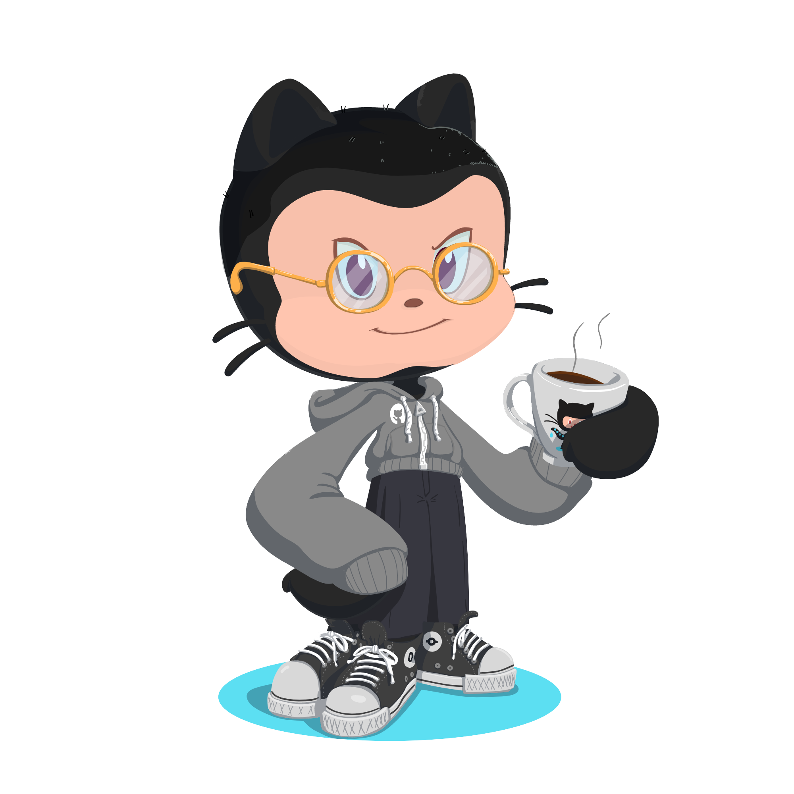

### Hello, Github!

#### I'm Gabriel Albuquerque :brazil:

:computer: Back-end Developer  
:mortar_board: Graduated in Systems Analysis  

#### I'm currently doing... :hammer:

:computer: Working with PHP  
:building_construction: Deeping into Design Patterns  
🐹 Learning Go  
:white_check_mark: Writing automated tests  
🐳 Venturing into Docker

#### Meet me at :coffee:

:pencil: [Medium](https://g4br.medium.com/)  
:briefcase: [LinkedIn](https://www.linkedin.com/in/gabriel-albuquerque-9a68b21a4/)  
🦊 [GitLab](https://gitlab.com/albuquerque53)
